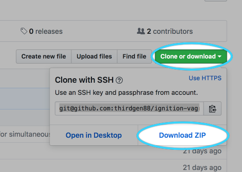
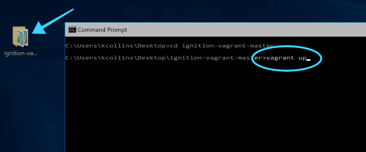
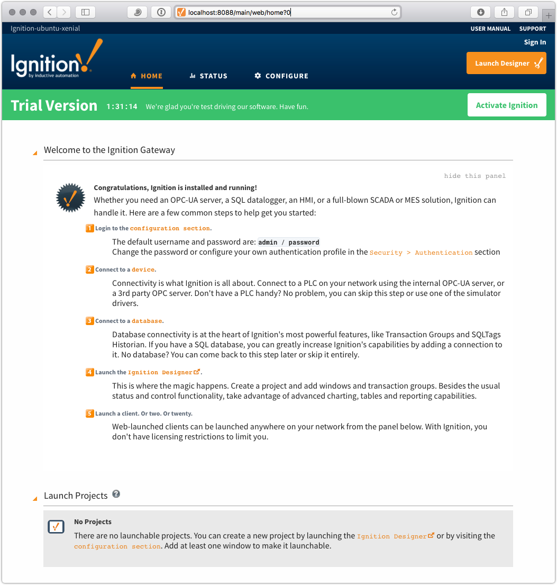

# Ignition Vagrant Development Environment


This repository utilizes Vagrant to fully setup and provision an isolated Ignition development system to get up and running quickly!

## Prerequisites

* VirtualBox
* Vagrant

## Getting Started

We're using [Vagrant](http://www.vagrantup.com) to handle the deployment of the environment.  Make sure that you have Vagrant installed by getting a download here:

https://www.vagrantup.com/downloads.html

You also need to have VirtualBox installed as the VM provider.  Get VirtualBox here:

https://www.virtualbox.org/wiki/Downloads

### Windows

First, download the repository to your computer (if you have `git` installed, you can clone as well):
> *Optional*: If you don't have a `git` client and want to be able to work with it, install *Git for Windows* 
> and get not only `git` but also `ssh` (and more):  [Git for Windows](https://git-for-windows.github.io)



Unpack the downloaded zip file, open a command prompt to the resulting location, and run `vagrant up`:




### Linux / macOS

First, open a terminal and clone this repository to your computer:

```bash
git clone https://github.com/thirdgen88/ignition-vagrant.git
```

> If you don't have `git` installed, you may get some additional output during this step.  macOS will typically prompt you to install the Xcode developer tools—once completed, you may need to re-run the `git` command above.

Next, start the environment:

```shell
cd ignition-vagrant
vagrant up
```


### All

Following the platform-specific steps above will create and provision an Ubuntu 18.04 development environment with MySQL and Ignition preinstalled.  Next, simply launch a web browser against the forwarded port on your local computer:

http://localhost:8088

If you see an Ignition Gateway Webpage, you're ready to go:



## Shutting down the environment

In order to shutdown the environment, run the following command in the `ignition-vagrant` folder:

```shell
vagrant halt
```

This will shutdown the virtual machine and release the network port configuration that was setup on launch.
